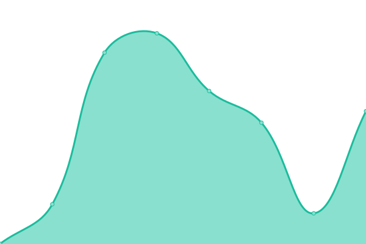

# [📈 Live Status](https://carbon-design-system.github.io/uptime): <!--live status--> **🟩 All systems operational**

This repository contains the open-source uptime monitor and status page for [Carbon](https://www.carbondesignsystem.com/), powered by [Upptime](https://github.com/upptime/upptime).

<!--start: status pages-->
<!-- This summary is generated by Upptime (https://github.com/upptime/upptime) -->
<!-- Do not edit this manually, your changes will be overwritten -->
<!-- prettier-ignore -->
| URL | Status | History | Response Time | Uptime |
| --- | ------ | ------- | ------------- | ------ |
|  [Carbon Design System](https://www.carbondesignsystem.com) | 🟩 Up | [carbon-design-system.yml](https://github.com/carbon-design-system/uptime/commits/HEAD/history/carbon-design-system.yml) | 

 303ms
     
 | 

<a href="https://carbon-design-system.github.io/uptime/history/carbon-design-system">100.00%</a>
    

|  [Carbon React Storybook](https://react.carbondesignsystem.com) | 🟩 Up | [carbon-react-storybook.yml](https://github.com/carbon-design-system/uptime/commits/HEAD/history/carbon-react-storybook.yml) | 

 571ms
     
 | 

<a href="https://carbon-design-system.github.io/uptime/history/carbon-react-storybook">100.00%</a>
    

|  [Carbon Charts Storybook](https://charts.carbondesignsystem.com) | 🟩 Up | [carbon-charts-storybook.yml](https://github.com/carbon-design-system/uptime/commits/HEAD/history/carbon-charts-storybook.yml) | 

 157ms
     
 | 

<a href="https://carbon-design-system.github.io/uptime/history/carbon-charts-storybook">100.00%</a>
    

|  [Carbon for IBM.com](https://www.ibm.com/standards/carbon) | 🟩 Up | [carbon-for-ibm-com.yml](https://github.com/carbon-design-system/uptime/commits/HEAD/history/carbon-for-ibm-com.yml) | 

 814ms
     
 | 

<a href="https://carbon-design-system.github.io/uptime/history/carbon-for-ibm-com">100.00%</a>
    

|  [Carbon for IBM.com Web Components Storybook](https://www.ibm.com/standards/carbon/web-components) | 🟩 Up | [carbon-for-ibm-com-web-components-storybook.yml](https://github.com/carbon-design-system/uptime/commits/HEAD/history/carbon-for-ibm-com-web-components-storybook.yml) | 

 183ms
     
 | 

<a href="https://carbon-design-system.github.io/uptime/history/carbon-for-ibm-com-web-components-storybook">100.00%</a>
    

|  [Carbon for IBM.com React Storybook](https://www.ibm.com/standards/carbon/react) | 🟩 Up | [carbon-for-ibm-com-react-storybook.yml](https://github.com/carbon-design-system/uptime/commits/HEAD/history/carbon-for-ibm-com-react-storybook.yml) | 

 206ms
     
 | 

<a href="https://carbon-design-system.github.io/uptime/history/carbon-for-ibm-com-react-storybook">100.00%</a>
    

|  [Carbon Web Components Storybook](https://web-components.carbondesignsystem.com) | 🟩 Up | [carbon-web-components-storybook.yml](https://github.com/carbon-design-system/uptime/commits/HEAD/history/carbon-web-components-storybook.yml) | 

 137ms
     
 | 

<a href="https://carbon-design-system.github.io/uptime/history/carbon-web-components-storybook">100.00%</a>
    

|  [Carbon Platform](https://next.carbondesignsystem.com) | 🟩 Up | [carbon-platform.yml](https://github.com/carbon-design-system/uptime/commits/HEAD/history/carbon-platform.yml) | 

 291ms
     
 | 

<a href="https://carbon-design-system.github.io/uptime/history/carbon-platform">100.00%</a>
    

<!--end: status pages-->

[**Visit our status website →**](https://carbon-design-system.github.io/uptime)

## 📄 License

- Powered by: [Upptime](https://github.com/upptime/upptime)
- Code: [MIT](./LICENSE) © [Upptime](https://upptime.js.org)
- Data in the `./history` directory: [Open Database License](https://opendatacommons.org/licenses/odbl/1-0/)
